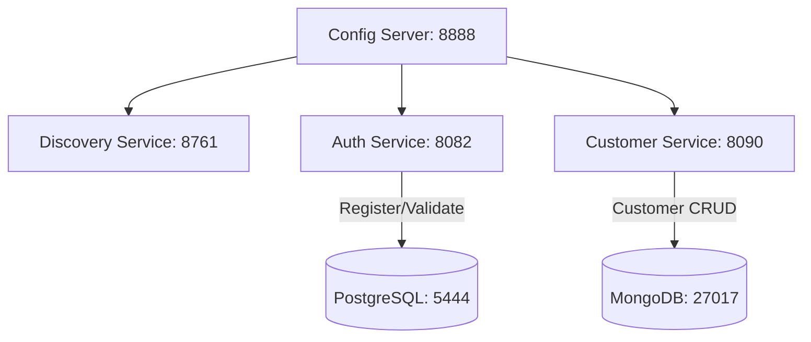

# My Finance - Microservices Project

A modern, robust financial microservices system built using **Java 21**, **Spring Boot 4.x**, **Spring Cloud (2025.x)**, **Docker**, and modern security/database standards.

---

## 📌 Project Overview

This repository implements a backend service architecture designed for financial/customer management. It leverages Spring Cloud to manage service discovery and centralized configuration, alongside containerized PostgreSQL and MongoDB databases.

---

## 🏗️ Architecture & Component Services

The system is split into four primary microservices and a Dockerized infrastructure layer:



### 1. Centralized Configuration Server (`config-server`)

- **Port:** `8888`
- **Technology:** Spring Cloud Config Server
- **Purpose:** Acts as a centralized configuration repository for all microservices using the `native` profile. Configuration files are stored under its resources (`classpath:/configurations`) and served dynamically.
- **Key Config Files Managed:**
  - `application.yml` (Common configurations, Eureka zones)
  - `auth-service.yml` (PostgreSQL connection strings, JPA setup, JWT secret & expiration)
  - `customer-service.yml` (MongoDB connection credentials and databases)
  - `discovery-service.yml` (Eureka Registry configuration)

### 2. Service Discovery Registry (`discovery`)

- **Port:** `8761`
- **Technology:** Netflix Eureka Server
- **Purpose:** Registers all microservice instances dynamically, allowing them to locate and communicate with each other without hardcoding network addresses.

### 3. Authentication Service (`auth-service`)

- **Port:** `8082`
- **Technology:** Spring Security, JWT (JSON Web Tokens), JPA, PostgreSQL
- **Purpose:** Handles application security, user registration, credentials checking, and token issuance/validation.
- **Database:** PostgreSQL (running in Docker container `ms_pg_sql` at port `5444`)
- **Key Endpoints:**
  - `POST /auth/register` - Register a new user (generates JWT token)
  - `POST /auth/login` - Logs in a user, returning a JWT token
  - `GET /auth/validate?token=<jwt-token>` - Validates standard JWT tokens and outputs a `UserDto` containing ID, Email, and Roles

### 4. Customer Service (`customer`)

- **Port:** `8090`
- **Technology:** Spring Data MongoDB, OpenAPI/Swagger UI
- **Purpose:** Exposes CRUD operations for customer details.
- **Database:** MongoDB (running in Docker container `mongo_db` at port `27017`)
- **Key Endpoints (`/customers/api/v1`):**
  - `POST /create` - Create a new customer profile
  - `GET /list` - List all registered customers
  - `GET /get/{id}` - Retrieve details of a customer by ID
  - `PUT /update/{id}` - Update a customer's name, email, or phone number
  - `DELETE /delete/{id}` - Delete a customer profile
- **API Documentation:** OpenAPI is integrated. Access Swagger UI at `http://localhost:8090/swagger-ui/index.html` once the service is running.

---

## 🐳 Infrastructure & Docker Setup

A `docker-compose.yml` file is provided in the `services/` directory to quickly spin up the required databases and their UI administration tools:

| Service           | Container Name  | Host Port | Internal Port | Description                           |
| :---------------- | :-------------- | :-------- | :------------ | :------------------------------------ |
| **PostgreSQL**    | `ms_pg_sql`     | `5444`    | `5432`        | Relational DB for user authentication |
| **pgAdmin4**      | `ms_pgadmin`    | `5050`    | `80`          | Web administration UI for PostgreSQL  |
| **MongoDB**       | `mongo_db`      | `27017`   | `27017`       | Document DB for customer records      |
| **Mongo Express** | `mongo_express` | `8081`    | `8081`        | Web administration UI for MongoDB     |

---

## 🚀 How to Run the Project

### Prerequisites

- Java 21 JDK or higher
- Maven 3.x+
- Docker Desktop installed and running

### Step 1: Start the Infrastructure Databases

Navigate to the `services` directory and boot up the Docker containers:

```bash
cd services
docker-compose up -d
```

You can access:

- pgAdmin: `http://localhost:5050` (Login: `pgadmin4@pgadmin.org` / Password: `admin`)
- Mongo Express: `http://localhost:8081` (Login: `glaymet` / Password: `glaymet`)

### Step 2: Start Services in Order

Start the services in the following order to allow proper loading:

1. **Config Server:**
   ```bash
   cd services/config-server
   mvn spring-boot:run
   ```
2. **Discovery Service (Eureka):**
   ```bash
   cd services/discovery
   mvn spring-boot:run
   ```
3. **Auth Service:**
   ```bash
   cd services/auth-service
   mvn spring-boot:run
   ```
4. **Customer Service:**
   ```bash
   cd services/customer
   mvn spring-boot:run
   ```

Verify all running instances register successfully in the Eureka Dashboard at `http://localhost:8761`.

---

## 🔒 Security & Configuration Details

- **Spring Cloud Config Import:** All clients import configuration templates from `config-server` on port `8888` via:
  ```yaml
  spring:
    config:
      import: "optional:configserver:http://localhost:8888"
  ```
- **Stateless Security:** `auth-service` uses stateless session management with BCrypt password hashing and JWT token filtration.
