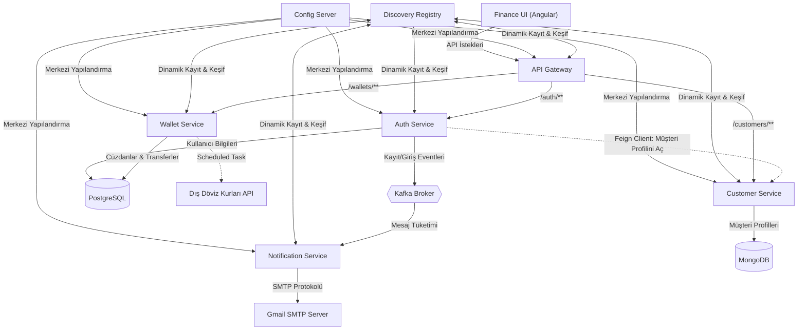

# My Finance - Mikroservis Projesi

Bu proje; **Java 21**, **Spring Boot**, **Spring Cloud**, **Kafka**, **Angular** ve **Docker** kullanılarak geliştirilmiş, ölçeklenebilir ve modern bir finansal yönetim platformudur. Proje kapsamında kullanıcıların üyelik, profil yönetimi, cüzdan işlemleri (para yatırma, çekme, transfer), canlı döviz kurları takibi ve anlık e-posta bildirimleri gibi uçtan uca tüm akışlar mikroservis standartlarında tasarlanmıştır.

---

## 🏗️ Genel Mimari Şema

Sistem; istemci (Angular UI) isteklerinin tek bir API Geçidinden (Gateway) geçmesi, servislerin birbirini Eureka Discovery ile keşfetmesi, haberleşmelerde OpenFeign ve Kafka kullanılması üzerine kurulmuştur:



---

## 🧩 Servisler ve Görevleri

Sistem, her biri tek bir sorumluluğa (Single Responsibility) sahip mikroservislerin bir araya gelmesiyle çalışır:

### 1. Yapılandırma Sunucusu (`config-server`) [Port: 8888]
* **Görevi:** Tüm mikroservislerin konfigürasyon dosyalarını (`application.yml` vb.) tek bir merkezden yönetir.
* **Çalışma Şekli:** Servisler ilk ayağa kalktıklarında bu sunucuya bağlanarak kendilerine ait veritabanı bağlantı bilgilerini, port ayarlarını ve özel tanımlarını çekerler.

### 2. Hizmet Kayıt Defteri (`discovery-service`) [Port: 8761]
* **Görevi:** Sistemdeki tüm mikroservislerin dinamik olarak kayıt olduğu ve birbirlerinin IP/Port bilgilerini öğrendiği Eureka sunucusudur.
* **Çalışma Şekli:** Bir servis diğerine istek atacağı zaman (örneğin Auth servisinin Müşteri servisine bağlanması) doğrudan IP yazmak yerine Eureka üzerinden isme göre dinamik yönlendirme yapar.

### 3. API Geçidi (`gateway`) [Port: 8060]
* **Görevi:** Dış dünyaya açılan tek kapıdır. İstemciden (Frontend) gelen tüm istekleri karşılar ve ilgili servislere yönlendirir.
* **Güvenlik:** Giriş (Login) ve Kayıt (Register) dışındaki korumalı servislere (Müşteri bilgileri, Cüzdanlar gibi) erişim isteklerini yakalar, JWT (JSON Web Token) kontrolünü yapar ve sadece geçerli token'a sahip isteklerin geçişine izin verir.

### 4. Kimlik Doğrulama Servisi (`auth-service`) [Port: 8082]
* **Görevi:** Kullanıcı üyelik işlemlerini, sisteme giriş kontrollerini ve güvenlik tokenı (JWT) üretimini yönetir.
* **Veritabanı:** Kullanıcı adı, şifre hash'leri (BCrypt) ve yetkileri **PostgreSQL** üzerinde saklanır.
* **Kafka Entegrasyonu:** Bir kullanıcı başarıyla kayıt olduğunda veya giriş yaptığında bunu sisteme duyurmak için Kafka'ya birer olay (Event) fırlatır.

### 5. Müşteri Yönetim Servisi (`customer`) [Port: 8090]
* **Görevi:** Müşterilerin detaylı profil bilgilerini (ad, soyad, telefon vb.) yönetir.
* **Veritabanı:** İlişkisel olmayan, esnek yapılı **MongoDB** üzerinde verileri saklar. 
* **Güvenlik:** E-posta adresi alanında veritabanı seviyesinde `unique = true` benzersizlik indeksi tanımlanarak mükerrer kullanıcıların oluşması engellenmiştir.

### 6. Cüzdan ve İşlem Servisi (`wallet-service`) [Port: 8081]
* **Görevi:** Kullanıcıların TRY, USD ve EUR cinsinden cüzdanlarını oluşturmasını, bakiye işlemlerini (Para Yatırma, Para Çekme, Cüzdanlar Arası Transfer) ve işlem geçmişi takibini yönetir.
* **Veritabanı:** Cüzdan bilgileri ve geçmiş işlemler (Transactions) **PostgreSQL** veritabanında tutulur.
* **Canlı Döviz Kurları:** Arka planda çalışan bir `Scheduled` zamanlayıcı görev (Task), belirli aralıklarla dış döviz kuru servislerinden güncel verileri çekerek yerel RAM hafızasında (`Cache`) tutar. Cüzdanlar arası farklı para birimlerinde transfer yapıldığında anlık çevrimler bu kurlar üzerinden hesaplanır.
* **İşlem Geçmişi:** Yapılan tüm işlemler tarihsel olarak paginated (sayfalı), işlem türüne veya tarihe göre filtrelenebilir olarak sorgulanabilir.

### 7. Bildirim Servisi (`notification`) [Port: 8085]
* **Görevi:** Kullanıcılara gönderilecek sistem bildirimlerini yönetir.
* **Çalışma Şekli:** Kafka üzerindeki ilgili konuları (Topic) dinler. Yeni bir kullanıcı kayıt olduğunda ya da sisteme giriş yapıldığında bu olayları yakalayarak kullanıcıya otomatik olarak hoş geldin ya da güvenlik uyarı e-postaları gönderir.

### 8. Finance Web UI (`finance-ui`) [Port: 4200]
* **Görevi:** Kullanıcıların sistemle etkileşime girdiği modern Angular arayüzüdür.
* **Özellikler:** 
  * Cüzdan bakiyelerini (TRY, USD, EUR) ve cüzdanlar arası hızlı para transfer ekranını barındırır.
  * Son işlemleri gösteren loglar, haftalık/aylık gelir-gider grafiklerini içeren canlı Dashboard ekranı sunar.
  * Üyelik kayıt ve giriş (JWT bazlı) sayfalarını içerir.

---

## 🔒 Gerekli Çevre Değişkenleri (Environment Variables)

Projeyi ayağa kaldırmadan önce aşağıdaki çevre değişkenlerinin (Environment Variables) terminallerinizde tanımlanmış veya `.env` dosyasında ayarlanmış olması gerekmektedir:

| Değişken Adı | Açıklama | Örnek Değer |
| :--- | :--- | :--- |
| `AUTH_DB_URL` | Auth veritabanı JDBC adresi | `jdbc:postgresql://localhost:5444/user` |
| `WALLET_DB_URL` | Cüzdan veritabanı JDBC adresi | `jdbc:postgresql://localhost:5444/user` |
| `DB_USERNAME` | PostgreSQL kullanıcı adı | `your-postgres-username` |
| `DB_PASSWORD` | PostgreSQL şifresi | `your-postgres-password` |
| `MONGO_HOST` | MongoDB adresi | `localhost` |
| `MONGO_USER` | MongoDB kullanıcı adı | `your-mongodb-username` |
| `MONGO_PASS` | MongoDB şifresi | `your-mongodb-password` |
| `JWT_SECRET_KEY` | JWT İmza anahtarı (Güvenli karakter dizisi) | `your-jwt-secret-key` |
| `KAFKA_SERVERS` | Kafka broker adresi | `localhost:9092` |
| `EUREKA_SERVER` | Eureka Keşif Sunucusu adresi | `http://localhost:8761/eureka` |
| `ZIPKIN_SERVER` | Dağıtık izleme sunucusu adresi | `http://localhost:9411/api/v2/spans` |
| `MAIL_USERNAME` | SMTP üzerinden mail atacak Gmail adresi | `example@gmail.com` |
| `MAIL_PASSWORD` | Gmail 16 haneli Uygulama Şifresi | `your-gmail-app-password` |

---

## 🚀 Projeyi Çalıştırma

### 1. Altyapıyı (Docker) Başlatma
Veritabanları, Kafka mesaj kuyruğu ve Zipkin izleme servisleri Docker Compose aracılığıyla ayağa kaldırılır.
```bash
cd services
docker-compose up -d
```

### 2. Servisleri Başlatma Sırası
Servislerin doğru şekilde birbirine bağlanabilmesi için şu sırayla çalıştırılması önerilir:
1. **`config-server`** (Yapılandırmaların okunabilmesi için en başta)
2. **`discovery`** (Diğer servislerin kayıt olabilmesi için)
3. **`auth-service`**, **`customer`**, **`wallet`**, **`notification`** (Çekirdek servisler)
4. **`gateway`** (Geçit kapısı)

#### Örnek Başlatma Komutu (PowerShell):
Her bir servisin klasörüne giderek aşağıdaki gibi çevre değişkenleriyle birlikte başlatabilirsiniz:
```powershell
$env:AUTH_DB_URL='jdbc:postgresql://localhost:5444/user'; $env:DB_USERNAME='your-postgres-username'; $env:DB_PASSWORD='your-postgres-password'; $env:JWT_SECRET_KEY='your-jwt-secret-key'; $env:KAFKA_SERVERS='localhost:9092'; $env:EUREKA_SERVER='http://localhost:8761/eureka'; $env:ZIPKIN_SERVER='http://localhost:9411/api/v2/spans'; $env:MONGO_USER='your-mongodb-username'; $env:MONGO_PASS='your-mongodb-password'; $env:MONGO_HOST='localhost'; $env:MAIL_USERNAME='example@gmail.com'; $env:MAIL_PASSWORD='your-gmail-app-password'; $env:WALLET_DB_URL='jdbc:postgresql://localhost:5444/user';
mvn spring-boot:run
```

### 3. Ön Yüzü (`finance-ui`) Çalıştırma
Node.js bağımlılıklarını kurup uygulamayı lokalde yayına alın:
```bash
cd finance-ui
npm install
ng serve
```
Tarayıcınızdan `http://localhost:4200` adresine girerek uygulamayı test edebilirsiniz.
