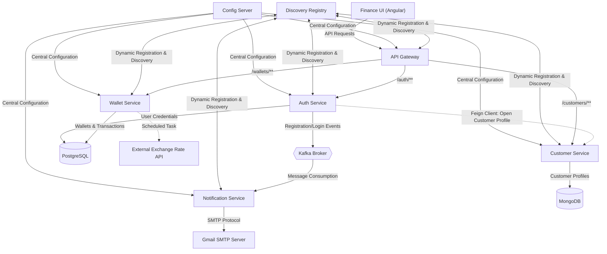

# My Finance - Microservices Project

This project is a scalable, modern financial management platform built using Java 21, Spring Boot, Spring Cloud, Kafka, Angular, and Docker. The system encapsulates end-to-end financial workflows in compliance with microservices standards, including user registration and login (JWT-based), profile management, multi-currency wallet creation (TRY/USD/EUR), real-time peer-to-peer transfers with live exchange rate conversions, deposits/withdrawals, and paginated transaction history tracking.

---

## 🏗️ Architecture Diagram

The system is designed with a single API Gateway routing client requests, services dynamically registering and discovering each other using Eureka Discovery, and communications handled via OpenFeign and Apache Kafka:

---

## 🛠️ Technologies Used

*   **Java 21** & **Spring Boot 3.x/4.x** (Backend Services)
*   **Angular 17+** (Frontend User Interface)
*   **Spring Cloud Gateway** (API Gateway & JWT Authentication)
*   **Spring Cloud Eureka** (Service Registry & Discovery)
*   **Spring Cloud Config Server** (Centralized Configuration Management)
*   **Apache Kafka** (Asynchronous Message Broker & Event Streaming)
*   **PostgreSQL** (User and Wallet/Transaction Data)
*   **MongoDB** (Customer Profile Data)
*   **Docker** & **Docker Compose** (Infrastructure Containerization)
*   **OpenFeign** & **Spring Cloud LoadBalancer** (Synchronous Inter-Service Communication)
*   **Spring Boot Starter Mail & JavaMailSender** (Automated Email Alerts)
*   **Zipkin** (Distributed Tracing & Request Tracking)
