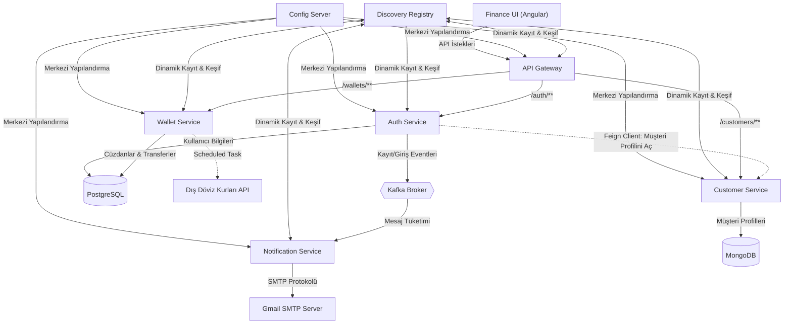

# My Finance - Mikroservis Projesi

Bu proje; Java 21, Spring Boot, Spring Cloud, Kafka, Angular ve Docker kullanılarak geliştirilmiş ölçeklenebilir ve modern bir finansal yönetim platformudur. Sistem kapsamında kullanıcıların kayıt olma ve giriş işlemleri (JWT bazlı), profil yönetimi, TRY/USD/EUR para birimlerinde cüzdan oluşturulması, cüzdanlar arası canlı döviz kurları ile para transferleri, para çekme/yatırma hareketleri ve tarihsel işlem geçmişi takibi gibi uçtan uca tüm finansal akışlar mikroservis standartlarında tasarlanmıştır.

---

## 🏗️ Genel Mimari Şema

Sistem; istemci (Angular UI) isteklerinin tek bir API Geçidinden (Gateway) geçmesi, servislerin birbirini Eureka Discovery ile keşfetmesi, haberleşmelerde OpenFeign ve Kafka kullanılması üzerine kurulmuştur:

---

## 🛠️ Kullanılan Teknolojiler

*   **Java 21** & **Spring Boot 3.x/4.x** (Arka Plan Servisleri)
*   **Angular 17+** (Kullanıcı Arayüzü)
*   **Spring Cloud Gateway** (API Geçidi & JWT Doğrulama)
*   **Spring Cloud Eureka** (Hizmet Keşfi & Kayıt Defteri)
*   **Spring Cloud Config Server** (Merkezi Yapılandırma Yönetimi)
*   **Apache Kafka** (Servisler Arası Asenkron Mesajlaşma & Olay Akışı)
*   **PostgreSQL** (Kullanıcı ve Cüzdan Verileri)
*   **MongoDB** (Müşteri Profilleri)
*   **Docker** & **Docker Compose** (Altyapı Konteynerizasyonu)
*   **OpenFeign** & **Spring Cloud LoadBalancer** (Senkron Servisler Arası İletişim)
*   **Spring Boot Starter Mail & JavaMailSender** (E-posta Bildirim Gönderimi)
*   **Zipkin** (Dağıtık İstek İzleme & Trace Takibi)
